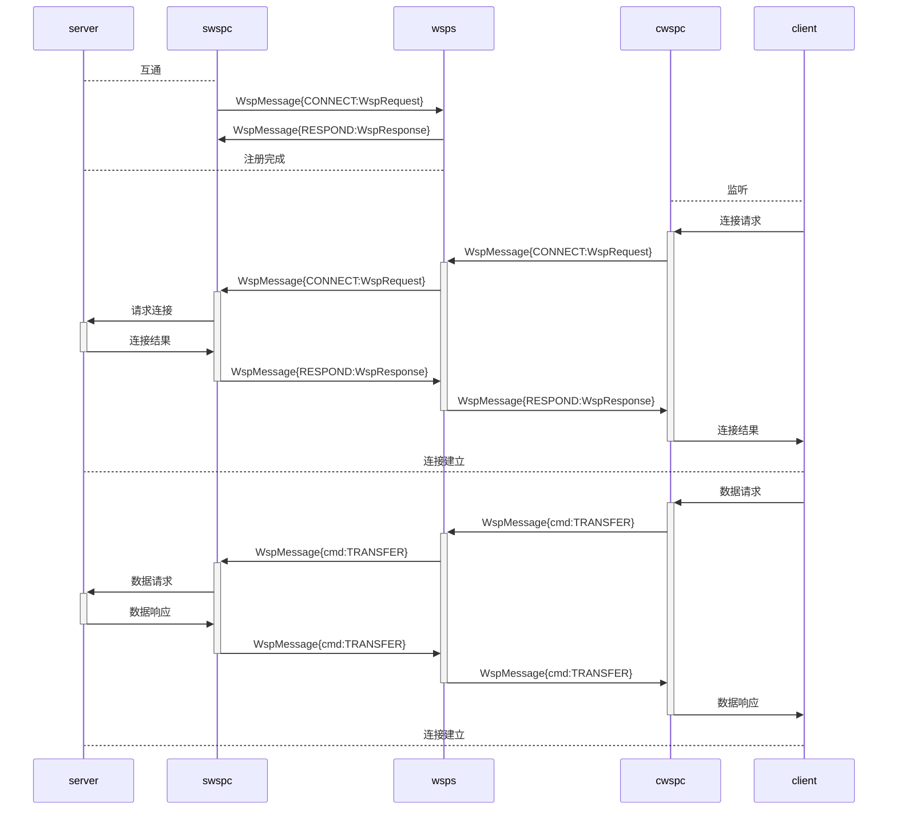

title: 基于websocket的网络穿透
date: 2022-03-19
updated: 2022-03-19
tags:
- Go
- Websocket
---
继上次介绍[wsp](https://github.com/gowsp/wsp)反向代理之后，本节来介绍下网络穿透的相关部分，它可以实现位于防火墙之后的两台机器的相互通信，是我目前正在使用的远程方案。
<!--more-->

## 网络穿透

现代互联网由于IP资源的枯竭，运营商使用NAT技术进行公网IP的复用，使得机器处于NAT设备之后，无法直接进行对等的交互。这时双方的机器可以利用websocket建立一条通讯隧道进行流量中转，达到直接通讯的目的

## 设计实现

### 交互流程

结构上网络穿透是最为复杂的其涉及到两条websocket流量桥接处理，交互上可以划分为三个部分

- swspc作为服务的提供方先接入wsps， 进行路由的注册
- cwspc作为服务的使用方请求wsps，请求匹配已注册的路由进行数据交互
- wsps作为服务桥梁将两条websocket的流量进行透传

### 注册路由

在交互流程中，需要一个全局路由信息sync.Map记录连接，key是连接标识，value是websocket连接，当客户机连接时这样就可以实现两条websocket的通讯。其配置格式：protocols://channel[:password]@[bind_address]:port

- protocols 支持 tcp
- channel信道标识，注册在wsps上等待其他wspc接入的标识信息
- password连接密码，接入的wspc连接密码需要一致才能通讯
- bind_address监听地址
- port服务端口

## 写在最后

网络穿透这部分功能其实是比较常用的，尤其是现在疫情期间时不时就会在家办公，可以提升不少的效率，同事之前用向日葵后面转用此方案，避免了不稳定的因素，希望可以帮助到大家。