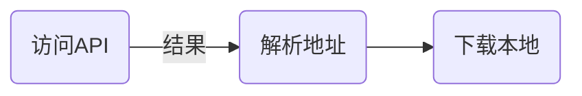

一直以来对 `bing` 的每日一图感到十分满意，便想着用 Shell 脚本收集起来，之前一直用正则匹配的方式获取图片标签来下载，但此方法不稳定，当 bing 官方修改标签就会导致抓取失败，直到某一天突然又失效了，于是忍无可忍的我 google 了下，发现了 [stackoverflow](https://stackoverflow.com/questions/10639914/is-there-a-way-to-get-bings-photo-of-the-day) 上有位老哥有同样需求，其中的答案启发了我，下面就来看看如何实现 Shell 抓取 bing 壁纸。

<!-- more -->

## 处理流程

先来简单的画画流程图：



一目了然，就像把大象装进冰箱一样。

## 访问 API

按照 [stackoverflow](https://stackoverflow.com/questions/10639914/is-there-a-way-to-get-bings-photo-of-the-day) 答案这里选用 `http://www.bing.com/HPImageArchive.aspx?format=js&idx=0&n=1`作为`获取API`

可以注意到 `API链接` 中有三个参数，其含义分别如下

- `format=js`：表示数据相应为 JSON 格式
- `idx=0`：表以今天的偏移量，0 表示今天，1 表示昨天，以此类推，最大值为 7
- `n=1`：表示返回偏移量之前的图片数量，最大值为 8

尝试用 `curl` 命令

```bash 
curl -s 'https://www.bing.com/HPImageArchive.aspx?format=js&idx=0&n=1'
```

可得到如下类似结果

```json
{
  "images": [
    {
      ...
      "url": "/th?id=OHR.QiXiFestival2022_ZH-CN2628111266_1920x1080.jpg&rf=LaDigue_1920x1080.jpg&pid=hp",
      ...
    }
  ],
  "tooltips": {
    ...
  }
}
```

## 解析地址

可以观察到地址是实际是在返回结果的 `images.url` 字段，那么该如何提取这个字段呢？

这里借助了 [jq](https://stedolan.github.io/jq/) 命令，`jq` 是一个非常强大的 Shell 命令，可以用来处理提取 `JSON` 数据，以此为例顺便介绍下 `jq` 的用法。

### 单字段提取

`jq` 以 `.字段名` 便可提取 `JSON` 对象字段，此例中需要提取 `images` 字段，示例如下：

```bash
curl -s 'https://www.bing.com/HPImageArchive.aspx?format=js&idx=0&n=1' | jq '.images
```

这样结果便只有 `images` 字段，输出如下

```json
[
  {
    ...
    "url": "/th?id=OHR.QiXiFestival2022_ZH-CN2628111266_1920x1080.jpg&rf=LaDigue_1920x1080.jpg&pid=hp",
    ...
  }
]
```

### 数组提取

可以看到 `images` 提取出的结果是数组，那么对数组又该如何处理呢？这里 `jq` 支持以 `.[数组下标]` 提取对应数组对象，此例中提取 `images` 数组的第一个元素，示例如下：

```bash
curl -s 'https://www.bing.com/HPImageArchive.aspx?format=js&idx=0&n=1' | jq '.images | .[0]'
```

可以看到 `jq` 是支持管道符的，在以上操作之后，输出如下

```json
{
  ...
  "url": "/th?id=OHR.QiXiFestival2022_ZH-CN2628111266_1920x1080.jpg&rf=LaDigue_1920x1080.jpg&pid=hp"
  ...
}
```

### url 提取

这是便又回到了对象字段提取的例子，此例中提取 `url` 字段，示例如下：

```bash
curl -s 'https://www.bing.com/HPImageArchive.aspx?format=js&idx=0&n=1' | jq '.images| .[0] | .url'
```

最终输出如下

```json
"/th?id=OHR.QiXiFestival2022_ZH-CN2628111266_1920x1080.jpg&rf=LaDigue_1920x1080.jpg&pid=hp"
```

是不是以为地址提取到此为止了？ NO～NO～NO NO～，可以观察到提取的结果前后带了 `"`，后续使用上非常不方便，好在`jq` 支持参数中加上 `-r`，字符串便会消除 `"`，示例如下：

```bash
curl -s 'https://www.bing.com/HPImageArchive.aspx?format=js&idx=0&n=1' | jq -r '.images| .[0] | .url'
```

## 下载本地

到此为止，我们已经提取到了图片的地址，下载就比较容易了，示例如下：

```bash
#!/bin/bash
img=`curl -s 'https://www.bing.com/HPImageArchive.aspx?format=js&idx=0&n=1' | jq -r '.images| .[0] | .url'`
curl -s "https://www.bing.com$img" -o bing.jpg
```

## 完整脚本

以上步骤组合起来便是如下

```bash
#!/bin/bash
# 存储路径
v_dir="/var/tmp"
data=`curl 'https://www.bing.com/HPImageArchive.aspx?format=js&idx=0&n=1' | jq '.images'`
# 取 images 数组长度
length=`echo $data | jq '. | length'`
length=`expr $length - 1`
for i in `seq 0 $length`
do
  # 取 images 数组第 i 个元素
  item=`echo $data | jq ".[$i]"`
  # 提取日期
  date=`echo $item | jq -r ".enddate"`
  # 图片名为日期
  file="$v_dir/$date.jpg";
  # 提取图片地址
  url=`echo $item | jq -r ".url"` 
  # 下载图片
  curl -s "https://www.bing.com$url" -o $file
done
```

## 写在最后

自此我们获得了一个可以下载 bing 壁纸的 shell 脚本，配合 `cron` 定时作业，可以实现每日抓取，我大概已经收集了两三年了，没事儿会翻出来看，希望可以帮助到大家。