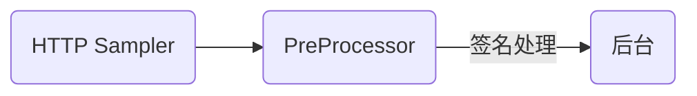

为了增强接口安全性，最近在请求上加了签名机制，但由于签名算法中组合了动态的时间戳导致测试难度提升，作为始作俑者我不得不帮助测试解决这个问题。于是记录下关于在 JMeter 中如果对 HTTP 请求进行拦截做签名处理。

## 问题核心

### 签名机制

首先简要介绍下本次所加的签名机制，签名的意义在于请求不被篡改，因此参与签名参数必须全部来源于请求的参数，这里选一些常规参数，如：

- HTTP 请求方法，例：GET、POST
- HTTP 请求路径，例：/xxx/xxx
- HTTP 请求时间戳，例：1654052923

将以上参数结合起来，再使用 `HmacSHA1` 以下列形式摘要生成 `X-Signature` 请求头

```
X-Signature=HmacSHA1('method=GET&path=/xxx/xxx&date=1654052923', xxxxxxxxxxxxxxx)
```

每次请求后台时皆按此进行签名，这样便保证了相对的安全性。不过这里只是简单的举例，实际参与签名参数比例子中的要更多，可以按照业务进行参数的增减。

### 测试难点

签名机制加完之后测试妹子是难过的，因为原先的 `JMeter` 脚本均是静态参数，接口处于无法验证状态。**PS：其实接口都是单元测试过的，应该没多少问题**。但口说无凭，为了解决这个问题，开始研究 `JMeter` 下使用签名的方式。

## 解决过程

### 方案确定

在 `JMeter` 官方[组件指南](https://jmeter.apache.org/usermanual/component_reference.html)中可以轻易找到所需要的资料，这里需要了解 `PreProcessor` ，顾名思义 `PreProcessor` 用来在请求前对采样器进行动态修改，类似拦截器，与我们的签名需求相符。接下来简单画画流程图理一下思路：



### PreProcessor

在[官方PreProcessor文档](https://jmeter.apache.org/usermanual/component_reference.html#preprocessors)中有几种`预处理器`，这里只需关注 `JSR223 PreProcessor`，另外的`BeanShell PreProcessor`是类似的，但官方已经不推荐使用了。根据`JSR223 PreProcessor` 文档介绍，`PreProcessor`脚本自动拥有如下成员变量：

- log - (Logger) - 可用于写入日志文件
- Label - 字符串标签
- FileName - 脚本文件名（如果有）
- Parameters - 参数（作为字符串）
- args - 作为字符串数组的参数（按空格分割）
- ctx - (JMeterContext) - 提供对上下文的访问
- vars - (JMeterVariables) - 提供对变量的读/写访问权限，如：
```
vars.get(key);
vars.put(key,val);
vars.putObject("OBJ1",new Object());
vars.getObject("OBJ2");
```
- props - (JMeterProperties - class java.util.Properties) - 例 `props.get("START.HMS"); props.put("PROP1","1234");`
- sampler - (Sampler)- 提供对当前采样器的访问
- OUT - System.out - 例 `OUT.println("message")`

### 编码实现

在本例的签名算法中，我们需要知道 `HTTP采样器` 的请求路径和请求方式，但 `PreProcessor` 文档并没有告诉我们这些，只是简单的介绍了些成员变量，那么签名算法中的参数该如何去取呢？

这时需要留意 `PreProcessor` 文档，点击 [Sampler](https://jmeter.apache.org/api/org/apache/jmeter/samplers/Sampler.html) 就会来到官方采样器 API 文档页，选择进入其中的 [HTTPSampler](https://jmeter.apache.org/api/org/apache/jmeter/protocol/http/sampler/HTTPSampler.html) 便可找到所需要的信息：

```java
// 获取 HTTP 方法
String method = sampler.getMethod();
// 获取 HTTP 路径
String path = sampler.getPath();
```

这里选择的执行引擎是 [BeanShell](https://beanshell.github.io/)，它内嵌于 `JMeter` 中使用方便，开箱即用。

`HmacSHA1` 摘要签名工具直接用 [Apache](https://commons.apache.org/proper/commons-codec/) 库即可，具体API的使用可以观摩[官方文档](https://commons.apache.org/proper/commons-codec/apidocs/org/apache/commons/codec/digest/HmacUtils.html)，以下便是一份完整的示例

```java
import java.time.Instant;
import org.apache.jmeter.protocol.http.control.Header;
import org.apache.jmeter.protocol.http.control.HeaderManager;

import org.apache.commons.codec.digest.HmacUtils;
import org.apache.commons.codec.digest.HmacAlgorithms;

String secret = "xxxxxxxxxxxxxxx";

HeaderManager headers = new HeaderManager();

void addHeader(String name, Object value){
	headers.add(new Header(name, value.toString()));
}

String method = sampler.getMethod();
String path = sampler.getPath();
long second = Instant.now().getEpochSecond();

String value = "method=" + method + "&path=" + path + "&date=" + second
String hmacHex = new HmacUtils(HmacAlgorithms.HMAC_SHA_1, secret).hmacHex(value);
addHeader("X-Signature", hmacHex);
addHeader("Date", second);

sampler.setHeaderManager(headers);
```

### 如何调试

如果脚本很复杂，调试就必不可少了，个人的经验是可以利用内置的成员变量 `log` 或 `OUT` 来打印输出参数，达到调试的目的

## 写在最后

看起来挺容易的，但前前后后花了大概两个小时，最后算是不负测试希望完美交卷，测试可以接着Happy的验接口找 bug 了。而我呢事了拂衣去，掌握了一门工具 `JMeter`，学会了一门脚本语言 `BeanShell`，收获还算不错。希望可以帮到大家。