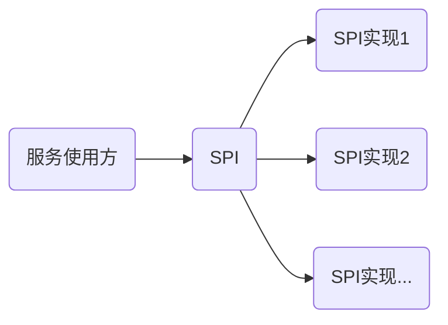
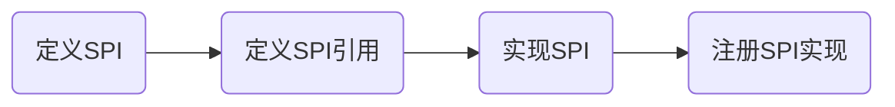

最近在学习中发现了个之前未曾了解的技术 `SPI`，全称 `Service Provider Interface` 其源于[Oracle 官方教程](https://docs.oracle.com/javase/tutorial/ext/basics/spi.html)中的一个概念。此外，`SPI 机制`在 `Dubbo` 和 `Spring` 中也有应用，这里做下记录学习。

<!-- more -->

## SPI

### 应用场景

SPI 机制解决了什么问题呢？在[官方教程](https://docs.oracle.com/javase/tutorial/ext/basics/spi.html)介绍如下

> 可在不修改原始代码的情况下对应用程序进行扩展，通过新的插件或模块来增强功能。

从设计模式来讲 `SPI` 是一种`桥接模式`，将程序接口和实现`解耦`，运行时动态替换接口实现类，为程序提供扩展功能。效果类似如下:



### 相关概念

[官方教程](https://docs.oracle.com/javase/tutorial/ext/basics/spi.html)中提出了三点概念：

- 服务：服务暴露方，组合调用`服务提供者接口`
- 服务提供者接口 (SPI)：定义应可用的类和方法
- 服务提供者：`SPI` 的实际实现

由服务提供者可以抽象出另外两点概念：

- 服务配置文件：描述 `SPI` 实现类的全限定名配置
- 服务加载器：加载器通过服务配置文件反射加载对应的 `SPI` 实现类

### 使用流程

使用基本如下



## 编码实战

下面就来实战演示下关于 `SPI` 在三种技术框架下的使用，源码已上传至 [github](https://github.com/gowsp/examples/tree/main/java-spi)。

### 定义 SPI

先定义 `SPI` 接口，假设存在一个服务员向客户问候接口

```java
@SPI
public interface Waiter {
    String greet();
}
```

**注：**`@SPI`注解为 `Dubbo SPI` 需要，JDK 和 Spring 并不需要此注解。 

### 实现SPI

现在店里有名中国服务员问候内容为中文

```java
public class Chinese implements Waiter {
    @Override
    public String greet() {
        return "你好";
    }
}
```

### 注册SPI实现

`SPI`的实现用对应的加载器进行加载，加载形式和配置要求需要按加载器来，下面介绍下配置形式

|框架|配置文件路径|配置内容格式|
|---|---|--|
|JDK| META-INF/services/${SPI接口全限定名} | ${SPI实现类} |
|Dubbo| META-INF/dubbo/${SPI接口全限定名} | 别名=${SPI实现类} |
|Spring|META-INF/spring.factories|\${SPI接口全限定名}=${SPI实现类}|

对应示例为如下

|框架|配置文件路径|内容|
|---|---|---|
|JDK| META-INF/services/ink.wuzk.examples.spi.Waiter | `ink.wuzk.examples.spi.Chinese` |
|Dubbo| META-INF/dubbo/ink.wuzk.examples.spi.Waiter | `chinese=ink.wuzk.examples.spi.Chinese` |
|Spring|META-INF/spring.factories|`ink.wuzk.examples.spi.Waiter=ink.wuzk.examples.spi.Chinese`|

### 加载调用

有了相关实现配置就需要读取配置的工具，这里就需要加载器登场了，如前文所讲的，加载器读取对应配置装载`SPI`的实现，以下是三种加载器：

|框架|服务加载器|加载形式|
|---|---|---|
|JDK| `java.util.ServiceLoader` | 直接加载使用 |
|Dubbo| `org.apache.dubbo.common.extension.ExtensionLoader` | 别名加载使用 |
|Spring|`org.springframework.core.io.support.SpringFactoriesLoader`|直接加载使用|

本例中测试代码如下

```java
    @Test
    void jdk() {
        for (Waiter waiter : ServiceLoader.load(Waiter.class)) {
            System.out.println(waiter.greet());
        }
    }

    @Test
    void dubbo() {
        ExtensionLoader<Waiter> loader = ExtensionLoader.getExtensionLoader(Waiter.class);
        Waiter chinese = loader.getExtension("chinese");
        System.out.println(chinese.greet());
    }

    @Test
    void spring() {
        List<Waiter> waiters = SpringFactoriesLoader.loadFactories(Waiter.class, null);
        for (Waiter waiter : waiters) {
            System.out.println(waiter.greet());
        }
    }
```

如果新增了实现，只需按上诉方式新增实现的模块即可。

## 写在最后

本文主要探讨 `SPI` 的组成和设计概念，并用例子实践一番，尚未触及源码部分，推荐有时间的情况下观摩这三者的源码，希望能帮到大家。