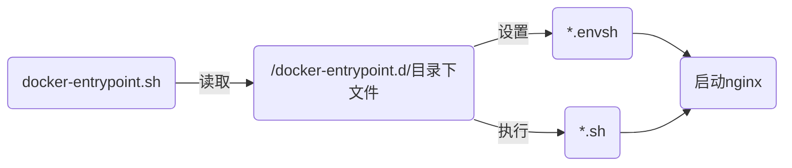

近段时间对 nginx 镜像进行了一些解构学习，参悟之后发现项目中对 nginx 镜像的定制和封装有些差强人意，下面就一起来看看如何利用官方扩展定制出符合项目需求的 nginx 镜像。
<!--more-->

## nginx镜像机制

在[nginx 官方镜像](https://hub.docker.com/_/nginx)入口文件为 `docker-entrypoint.sh`，运行流程如下



入口文件在官方[github](https://github.com/nginxinc/docker-nginx/tree/master/entrypoint)中可以找到对应的 `shell` 脚本，想要详细了解的可以去看看。

### 插件机制

入口文件表明 nginx 容器在运行前会读取 `/docker-entrypoint.d/` 目录下相关文件做准备工作

- 可执行的`.envsh` 做环境变量导入处理
- 可执行的`.sh`做执行操作

这样就形成了一种插件机制，动态的做启动前的准备，在官方 nginx 镜像中 `/docker-entrypoint.d/` 内置了如下脚本

- 10-listen-on-ipv6-by-default.sh IPv6监听处理
- 20-envsubst-on-templates.sh 模板文件环境变量替换
- 30-tune-worker-processes.sh 一些优化操作，只有在`NGINX_ENTRYPOINT_WORKER_PROCESSES_AUTOTUNE`设置值之后才会生效

其中的 `20-envsubst-on-templates.sh` 又为开发人员带来新特性：变量替换。

### 变量替换

运行时的容器配置并不是一成不变的，需要在启动前做一些特殊的处理，于是官方便内置了模板文件变量替换的功能。

结合`20-envsubst-on-templates.sh`脚本可以知道，该脚本会读取`/etc/nginx/templates/*.template`文件通过执行`envsubst`命令将配置文件输出至`/etc/nginx/conf.d`目录下，以此来达成配置的动态变化能力。

例如有份`/etc/nginx/templates/default.conf.template` 的模板文件，包含如下内容

```
listen       ${NGINX_PORT};
```

当指定环境变量 `NGINX_PORT=80` 时，启动容器后将生成 `/etc/nginx/conf.d/default.conf`，内容相应的被替换

```
listen       80;
```

关于 nginx 模板的读取和输出位置是可以设置，有兴趣可以阅读关联的[shell脚本](https://github.com/nginxinc/docker-nginx/tree/master/entrypoint)。

## 动手实践

原先项目中镜像定制主要围绕以下几点

- 证书的拷贝
- 配置文件的环境变量替换
- 前端文件的拷贝

最后一点暂不处理，但是前两点是可以利用 nginx 官方镜像机制实现的。

### 证书生成

关于第一点证书拷贝其实并意义不大，由于项目是私有化的部署基本都是在内网下，直接使用证书生成更为合适，这里就结合插件机制直接生成即可，这里加入了`40-auto-generate-certificates.sh` 脚本，内容如下

```shell
#!/bin/sh
set -e

ME=$(basename $0)

entrypoint_log() {
    if [ -z "${NGINX_ENTRYPOINT_QUIET_LOGS:-}" ]; then
        echo "$@"
    fi
}
generate(){
  local ssl_dir="/etc/nginx/ssl"
  # 检测是否已生成 ssl
  if [ -e $ssl_dir ]; then
      entrypoint_log "$ME: ssl dir exists, skipp generate"
      exit 0
  fi
  mkdir $ssl_dir
  # 读取待生成的域名
  local domain_name="${DOMAIN_NAME:-localhost}"
  entrypoint_log "$ME: start generate $domain_name cert"
  # 生成证书
  openssl req -x509 -newkey rsa:4096 -keyout "$ssl_dir/key.pem" -out "$ssl_dir/cert.pem" -sha256 -days 3650 \
    -nodes -subj "/CN=$domain_name"
  openssl dhparam -out "$ssl_dir/dhparam.pem" 2048
}
generate
exit 0
```

脚本内容不多，在容器第一次启动时生成自签名证书，满足私有化的安全要求。

### Dockerfile

接下来就是完整的 Dockerfile

```
FROM nginx:1.23.2-alpine
ENV DIMAIN_NAME=localhost HTTP_PORT=80 HTTPS_PORT=443
RUN sed -i 's/dl-cdn.alpinelinux.org/mirrors.aliyun.com/g' /etc/apk/repositories  \
    && apk add --no-cache openssl
COPY 40-auto-generate-certificates.sh /docker-entrypoint.d
COPY nginx /etc/nginx
```

主要目的有三个：

- 添加`openssl`用于证书生成
- 将插件文件放入相关目录
- 将优化的nginx配置和模板文件放置在nginx目录下启动使用

完整的源码已放在[github](https://github.com/gowsp/examples/tree/main/docker-nginx-auto-ssl)上，有兴趣的同学可以参考下。

## 写在最后
 
原先项目镜像配置缺乏模块化，虽然能运行但配置繁琐，另外造了一个启动文件的轮子，缺乏对原有镜像的分析理解，希望自己以后不要犯类似的错误。
