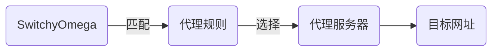

当有了一台代理服务之后如何在客户端上设置代理就成为了接下来的问题，目前个人常用的是[SwitchyOmega插件](https://github.com/FelisCatus/SwitchyOmega)其在 chrome 浏览器上工作表现良好，这里就来简单的介绍下如何安装使用它。
<!--more-->

## 代理端

SwitchyOmega 作为客户端代理，并不具备穿透防火墙能力，需要自建代理服务器，这里用个人开发的 [wsp](https://github.com/gowsp/wsp) 做代理服务。

- 下载对应的 `wspc` 客户端，下载地址为 `https://github.com/gowsp/wsp/releases/latest/download/wsp_0.5.1_windows_amd64.zip`
- 将`wsp_0.5.1_windows_amd64.zip` 解压至指定位置，拷贝 `configs/wspc_template.json` 为 `wspc.json` 保存在与 `wspc.exe` 同一目录中
- 假设已经有一台 `wsps` 的服务，其服务地址为 `wss://wsps.com:8010/proxy`，密钥为 `token`，修改 `wspc.json` 内容如下

```json
{
    "log": {
        "level": "info"
    },
    "client": [
        {
            "auth": "token",
            "server": "wss://wsps.com:8010/proxy",
            "dynamic": [
                "socks5://:1080"
            ]
        }
    ]
}
```

双击 `wspc.exe` 完成客户端的启动

## 安装 SwitchyOmega

关于 的安装在其[发布说明](https://github.com/FelisCatus/SwitchyOmega/releases)有相关介绍，但其在使用上存在不便，这里介绍例外一种不同的方式

在[Chromium](https://www.chromium.org/developers/design-documents/network-stack/socks-proxy/)说明中有提到，通过命令行可以直接指定代理，以此来连接外部网络，使用方式如下

在命令行中增加参数 `--proxy-server="socks5://myproxy:8080"` 在本例中对应为 `--proxy-server="socks5://127.0.0.1:1080"`

对于非开发人员可能能命令行不熟悉，可以通过修改谷歌浏览器的快捷方式来实现

- 关闭所有已打开的谷歌浏览器
- 右键谷歌浏览器快捷方式，单击属性
- 在`目标`一栏追加配置`--proxy-server="socks5://127.0.0.1:1080"`
- 最终效果类似`"C:\Program Files\Google\Chrome\Application\chrome.exe" --proxy-server="socks5://127.0.0.1:1080"`

此时谷歌浏览器将使用全局的代理上网方式，进入[SwitchyOmega](https://chrome.google.com/webstore/detail/proxy-switchyomega/padekgcemlokbadohgkifijomclgjgif)的商店页面，点击添加完成安装

待安装完成之后关闭浏览器，如果修改了快捷方式，则按原步骤还原`目标`一栏的配置

## 配置 SwitchyOmega

SwitchyOmega 工作原理如下



- 首先我们需要为 SwitchyOmega 添加一台代理服务，在情景模式 proxy 栏填上代理服务地址，如 `127.0.0.1` `1080`

![][01]

- 修改情景模式 `auto switch` 设置代理规则，这里使用地址`https://pagure.io/gfwlist/raw/master/f/gfwlist.txt` 点击立即更新
- 修改`规则列表规则`情景模式为`proxy`
- 修改`	默认情景模式`为`直接连接`

![][02]

- 点击圆圈将代理模式设置为 `auto switch`

![][03]

## 写在最后

使用这种方式在一定程度上可以避免全局的代理流量消耗，并且可以动态控制网站是否走代理，比设置系统代理更加的安全无污染，希望可以帮助到大家。

[01]:https://preview.cloud.189.cn/image/imageAction?param=127FFC334600F6CEF65D9425039E2AFF18652EBE47416FCC816554D3980A554778CBFD1D53A11B5162F726A88DA9CC35867045766D2F11CA3192D4D189CCCB4FAE4165B5E9E5580F78159CD283703817B0AB8E07E67F1D3CC056B3BDCE92D2AA88AF9195139101E9140580DA043A7458
[02]:https://preview.cloud.189.cn/image/imageAction?param=165FAD218E7906291AE1BF5E4AF9B71BA00BE0E10740090F954FD94C74E8FFDCC8A158E35669C6DA91CA7B1113E2EC4061B7EBA86B5370553D3E942BA107609F85D674CB26EB03B6AF655E2503AA0C851ECEED7C3BE3384EB20BD834AA04DDFEEBE8DA6B76F1E0AD0D80A0DFE0DACC5A
[03]:https://preview.cloud.189.cn/image/imageAction?param=68F77C69538ECB5857E05724C091CB9BAC072751BE97EF9F52F4B5E55D2F270B9C966FD7CEED1F77A9A8C795F894E729883F827BDA70A55162B03F301B8C364BAEE26C1E430C1925F5654CD1E7515939828E07D6C21C725A66CA9602C1ABBBB6C7A3D80DCC53BD4CA81BAF88D4D45824
