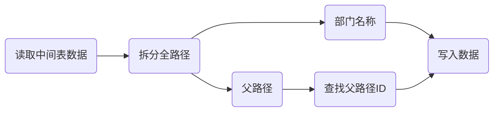

日常工作中我们经常会遇到一些临时数据处理需求，常规的编程手段虽然可以解决, 但通常时间紧迫需要快速处理上线，这时便可以考虑用纯SQL方式, 如Oracle的 PL/SQL 脚本又或是存储过程, 这里整理记录一下线上数据处理流程。
<!--more-->

## 需求引入

某天产品经理突然丢过来一个 Excel 让把其中的部门信息导入到线上的一个企业里，从产品设计角度来讲这应该算是一个功能需求了，但遗憾的是目前并没有这样的功能，只能临时处理，当前部门表结构如下

```sql
-- 部门表, 已做简化
CREATE TABLE `t_department` (
	`id` INT(10) UNSIGNED NOT NULL AUTO_INCREMENT COMMENT '部门id',
	`name` VARCHAR(64) NULL DEFAULT NULL COMMENT '部门名称',
	`parent_id` INT(10) UNSIGNED NULL DEFAULT NULL COMMENT '父部门id',
	PRIMARY KEY (`id`) USING BTREE
);
```

给定的 Excel 数据内容类似如下

```csv
/a
/a/b
/a/b/c
/a/d
/a/d/e
```

## 处理流程


数据处理无外乎**增删改**，但实际需求复杂多变通常需要配合中间表协同处理，本次需求已知全路径信息现需要写入部门表中。

### 构建中间表

拿到需求数据后首先要考虑讲数据导入至中间表中，以方便后续的处理

- 表结构设计，一般直接按需求数据列设计，本次需求只有单列数据，故可以先设计的中间表名为`t_temp_data`, 列有自增主键`id` 全路径数据`full_path`此列设置为唯一键
- 将数据导入至中间表中，一般SQL工具都有导入csv数据的功能，可以自行摸索

导入后数据显示如下

|id|full_path|
|--|--|
|1 |/a|
|2 |/a/b|
|... |...|

### 编写存储过程

存储过程的编写依赖于业务的逻辑分析，拆解之后处理步骤如下



通常数据单条处理操作主要使用[游标](https://dev.mysql.com/doc/refman/8.0/en/cursors.html)来进行处理，本例中处理结构如下

```sql
BEGIN
  -- 暂存的ID变量
  DECLARE v_id INT;
  -- 暂存的全路径变量
  DECLARE v_path VARCHAR(128);
  -- 游标完成标志
  DECLARE v_done INT DEFAULT FALSE;
  -- 声明游标从特定语句获取数据
  DECLARE v_dep CURSOR FOR SELECT id, full_path FROM t_temp_data;
  -- 游标遍历结束时设置完成标志
  DECLARE CONTINUE HANDLER FOR NOT FOUND SET v_done = TRUE;
  -- 打开游标
  OPEN v_dep;
  v_loop: LOOP
    -- 将游标数据读入变量中
    FETCH v_dep INTO v_id, v_path;
    -- 判断游标完成标志结束
    IF v_done THEN
      -- 游标已结束，退出
      LEAVE v_loop;
    END IF;
    -- 数据处理逻辑
  END LOOP;
  -- 关闭游标
  CLOSE v_dep;
END
```

接下来要完善数据处理逻辑，按之前分析需要将全路径拆分为父路径和子路径，这就需要对 MySQL [字符串函数](https://dev.mysql.com/doc/refman/8.0/en/string-functions.html)有一定了解学习，经过甄别后最终选出了两个适用函数

- 提取父路径 [SUBSTRING_INDEX](https://dev.mysql.com/doc/refman/8.0/en/string-functions.html#function_substring-index)，通过分隔符截断提取字符串
- 提取子路径 [REGEXP_SUBSTR](https://dev.mysql.com/doc/refman/8.0/en/regexp.html#function_regexp-substr)，通过正则匹配分割提取字符串，本例中用到的正则公式相对简单

```sql
SELECT SUBSTRING_INDEX('/a/b/c', '/', 2), REGEXP_SUBSTR('/a/b/c', '[^/]+', 1, 2)
UNION ALL 
SELECT SUBSTRING_INDEX('/a/b/c', '/', 3), REGEXP_SUBSTR('/a/b/c', '[^/]+', 1, 3);
```

| SUBSTRING_INDEX('/a/b/c', '/', 2) | REGEXP_SUBSTR('/a/b/c', '[^/]+', 1, 2) | 
| --- | --- | 
| /a | b | 
| /a/b | c | 


通过输出效果可以看到两个函数成功的把数据分离了父路径和子路径，最后一个参数作为剥离标志位，可以对指定层级进行剥离，有了这个铺垫后可以编写如下相关逻辑

```sql
  -- 声明处理位
  DECLARE v_index INT;
  DECLARE v_insert_id INT;
  -- 声明当前处理路径
  DECLARE v_curent_path VARCHAR(128);
  -- 声明子路径名
  DECLARE v_name VARCHAR(128);
  -- 声明父路径ID
  DECLARE v_parent_id INT;
  -- 声明父路径
  DECLARE v_parent_path VARCHAR(128);
  ...
    -- 游标开始设置处理位为1
    SET v_index = 1;
    -- 开启逐级路径处理循环
    v_process:LOOP
      -- 开始处理第下一位路径
      SET v_index = v_index + 1;
      -- 提取子路径名
      SELECT REGEXP_SUBSTR(v_path, '[^/]+', 1, v_index) INTO v_name;
      IF v_name IS NULL THEN
        -- 提取空值表示当前记录处理结束
        LEAVE v_process;
      END IF;
      -- 提取当前处理路径
      SELECT SUBSTRING_INDEX(v_path, '/', v_index + 1) INTO v_curent_path;
      -- 跳过已处理路径(1)
      IF EXISTS(SELECT 1 FROM t_temp_data WHERE full_path = v_curent_path AND dep_id IS NULL) THEN
        -- 查找父ID(2)
        SELECT dep_id INTO v_parent_id
        FROM t_temp_data
        WHERE full_path = SUBSTRING_INDEX(v_path, '/', v_index);
        -- 写入表数据
        INSERT INTO `t_department` (`name`, `parent_id`) VALUES (v_name, v_parent_id);
        -- 更新或写入当前处理路径ID(3)
        SELECT LAST_INSERT_ID() INTO v_insert_id;
        INSERT INTO t_temp_data(full_path, dep_id) 
        VALUES(v_curent_path, v_insert_id) 
        ON DUPLICATE KEY UPDATE dep_id = v_insert_id;
      END IF;
    END LOOP;
  ...
```

由于当前顺序处理逻辑导致，存储过程中可以看到中间表新增了一列`dep_id`，增加这一列可以有以下好处

- 位置`(1)`做跳过判断，可以避免重复的父路径数据写入
- 支持位置`(2)`父路径的ID查询
- 相对应的需要在位置`(3)`处将新ID更新写入
- 由于处理逻辑是顺序处理，因此需要手动把根节点id赋值给中间表，本例中设置为 1

如此就完成了处理逻辑，接下来将存储结构和中间表用`mysqldump`或`SQL编辑器`导出，导出结果类似如下

```sql
DROP PROCEDURE IF EXISTS `p_dep_insert`;
DELIMITER //
CREATE PROCEDURE `p_dep_insert`()
BEGIN
  -- 暂存的ID变量
  DECLARE v_id INT;
  -- 暂存的全路径变量
  DECLARE v_path VARCHAR(128);
  -- 声明处理位
  DECLARE v_index INT;
  DECLARE v_insert_id INT;
  -- 声明当前处理路径
  DECLARE v_curent_path VARCHAR(128);
  -- 声明子路径名
  DECLARE v_name VARCHAR(128);
  -- 声明父路径ID
  DECLARE v_parent_id INT;
  -- 声明父路径
  DECLARE v_parent_path VARCHAR(128);
  -- 游标完成标志
  DECLARE v_done INT DEFAULT FALSE;
    -- 声明游标从特定语句获取数据
  DECLARE v_dep CURSOR FOR SELECT id, full_path FROM t_temp_data;
  -- 游标遍历结束时设置完成标志
  DECLARE CONTINUE HANDLER FOR NOT FOUND SET v_done = TRUE;
  -- 打开游标
  OPEN v_dep;
  v_loop: LOOP
    -- 将游标数据读入变量中
    FETCH v_dep INTO v_id, v_path;
    -- 判断游标完成标志结束
    IF v_done THEN
      -- 游标已结束，退出
      LEAVE v_loop;
    END IF;
    -- 数据处理逻辑
    SET v_index = 1;
    -- 开启逐级路径处理循环
    v_process:LOOP
      -- 开始处理第下一位路径
      SET v_index = v_index + 1;
      -- 提取子路径名
      SELECT REGEXP_SUBSTR(v_path, '[^/]+', 1, v_index) INTO v_name;
      IF v_name IS NULL THEN
        -- 提取空值表示当前记录处理结束
        LEAVE v_process;
      END IF;
      -- 提取当前处理路径
      SELECT SUBSTRING_INDEX(v_path, '/', v_index + 1) INTO v_curent_path;
      -- 跳过已处理路径(1)
      IF EXISTS(SELECT 1 FROM t_temp_data WHERE full_path = v_curent_path AND dep_id IS NULL) THEN
        -- 查找父ID(2)
        SELECT dep_id INTO v_parent_id
        FROM t_temp_data
        WHERE full_path = SUBSTRING_INDEX(v_path, '/', v_index);
        -- 写入表数据
        INSERT INTO `t_department` (`name`, `parent_id`) VALUES (v_name, v_parent_id);
        -- 更新或写入当前处理路径ID(3)
        SELECT LAST_INSERT_ID() INTO v_insert_id;
        INSERT INTO t_temp_data(full_path, dep_id) 
        VALUES(v_curent_path, v_insert_id) 
        ON DUPLICATE KEY UPDATE dep_id = v_insert_id;
      END IF;
    END LOOP;
  END LOOP;
  -- 关闭游标
  CLOSE v_dep;
END//
DELIMITER ;

DROP TABLE IF EXISTS `t_temp_data`;
CREATE TABLE IF NOT EXISTS `t_temp_data` (
  `id` int NOT NULL AUTO_INCREMENT COMMENT '主键ID',
  `full_path` varchar(128) COLLATE utf8mb4_unicode_ci DEFAULT NULL COMMENT '全路径',
  `dep_id` int DEFAULT NULL COMMENT '写入ID',
  PRIMARY KEY (`id`),
  UNIQUE KEY `uk_full_path` (`full_path`)
) ENGINE=InnoDB AUTO_INCREMENT=6 DEFAULT CHARSET=utf8mb4 COLLATE=utf8mb4_unicode_ci;

INSERT INTO `t_temp_data` (`id`, `full_path`, `dep_id`) VALUES
	(1, '/a', 1),
	(2, '/a/b', NULL),
	(3, '/a/b/c', NULL),
	(4, '/a/d', NULL),
	(5, '/a/d/e', NULL);
```

导出之后追加如下调用及清理语句，之后发给相关人员在线上执行即可

```sql
CALL p_insert_dep();
DROP TABLE IF EXISTS `t_temp_data`;
DROP PROCEDURE IF EXISTS `p_dep_insert`;
```

## 写在最后

通过灵活的运用相关知识可以从容有效的应对复杂的需求，当然这次的需求处理还有其他思路，比如例子中用的是顺序处理，实际也可用倒序处理方式，这样可以降低父路径遍历写入的开销，当然也可用常规的编程方式例如用`Spring Shell`代码处理，方法思路多种多样，条条大路通罗马希望本篇可以带你到罗马。