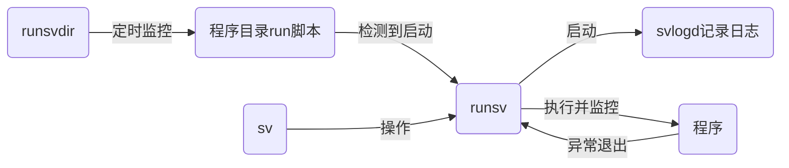

由于经常对自己的开发板刷系统，所以我决定构建个容器镜像来保存常用的功能，现成的有`docker-compose`来进行容器调度，不过我对这种多容器的方式不太感冒，希望在一个容器里实现，于是我找了下资料发现在 [Docker进阶教程中](https://docs.docker.com/config/containers/multi-service_container/)记录了启动多个进程的方法，但效果不是很好，最后发现用 [Runit](http://smarden.org/runit/)有不错的效果，下面就来介绍下。
<!--more-->

## Runit 优势

这里先来提一下[Docker进阶教程中](https://docs.docker.com/config/containers/multi-service_container/) 记录的一些方法

- 一类使用脚本 `&` 包装处理，这种太过简陋，可用性太差
- 一类使用进程管理器 `supervisord` 来管理，这种方式倒是不错，灵活度高可靠性强，但遗憾的是对于一块开发板来讲资源占用过大了

相比较官方 [Runit](http://smarden.org/runit/) 最大的优势就是轻量灵活，对于一块性能孱弱的开发板服务器来说轻量就是王道，这意味着宝贵的资源不会浪费。另外它具备 监控，日志 功能，相比较于脚本可以应对一些复杂的需求。那么就进入正题看看怎么用起来。

## 快速上手

### 程序组成

这里先来介绍 Runit 的程序组成

- [chpst](http://smarden.org/runit/chpst.8.html) 变更进程状态的程序执行器
- [svlogd](http://smarden.org/runit/svlogd.8.html) 服务日志记录守护进程
- [runsv](http://smarden.org/runit/runsv.8.html) 启动并监视服务以及可附加日志服务
- [runsvdir](http://smarden.org/runit/runsvdir.8.html) 启动并监视 runsv 进程的集合
- [sv](http://smarden.org/runit/sv.8.html) 控制和管理由 runsv 监控的服务

这里主要介绍例子里使用到的，Runit 的其他程序可以看看它的[官方文档](http://smarden.org/runit/)去了解使用。

### 运行流程

整体运行逻辑如下



可能有人会问 chpst 怎么没出现？它主要用于改变进程状态，其实是个可选项，可以用在程序的 run 脚本和日志的 run 脚本中

### 组织应用

这里用自己的 [wsp](https://github.com/gowsp/wsp) 应用做演示，构建一个启动服务端 客户端的两个应用程序的镜像

```sh
# 创建构建目录
mkdir runit && cd runit
# 创建服务目录
mkdir service && cd service
# 创建两个应用目录
mkdir wsps wspc
```

接着将二进制文件放入到对应的文件夹里，效果如下

```sh
.
|-- Dockerfile
`-- service
    |-- wspc
    |   |-- wspc
    |   `-- wspc.json
    `-- wsps
        |-- wsps
        `-- wsps.json
```

由于 `runsv` 监控的是应用目录下的 run 脚本，所以需要在服务目录里编写 run 脚本， 脚本内容如下

```sh
# cat service/wspc/run 
#!/bin/sh
exec chpst -u root ./wspc -c wspc.json
# cat service/wsps/run 
#!/bin/sh
exec chpst -u root ./wsps -c wsps.json
```

这里偷懒用 chpst 命令改变了运行的用户为 root，实际可以指定其他用户，当然还有其他参数，可以自行[参考文档](http://smarden.org/runit/chpst.8.html)使用，这里就不再赘述。

### 输出日志

接着可以添加终端日志输出，是否输出日志是可选的，这里为了加强学习体现完整性，还是做下示范，前面提到日志服务需要依赖 `svlogd` 程序，那么如何让 `runsv` 启动日志服务呢？答案与运行程序类似，在程序目录创建一个 `log` 目录并添加 `run` 脚本即可，如下是一个范例

```sh
# cat service/wspc/log/run 
#!/bin/sh
mkdir /var/log/wspc
exec chpst -u root svlogd -tt /var/log/wspc
# cat service/wsps/log/run 
#!/bin/sh
mkdir /var/log/wsps
exec chpst -u root svlogd -tt /var/log/wsps
```
注意记得将 `run` 脚本全部添加可执行权限。

### 构建镜像

接着便是着手编写 `Dockerfile`，如下是我的示例

```Dockerfile
FROM alpine:3.18.4
RUN sed -i 's/dl-cdn.alpinelinux.org/mirrors.aliyun.com/g' /etc/apk/repositories \
    && apk add --no-cache runit
COPY service /etc/service
ENTRYPOINT ["runsvdir", "/etc/service"]
```

可以看到步骤相对简单，以 `alpine` 为基础镜像，替换仓库镜像，安装 `runit` 拷贝文件，启动 `runsvdir` 监视目录，最后目录结构效果如下

```sh
.
|-- Dockerfile
`-- service
    |-- wspc
    |   |-- log
    |   |   `-- run
    |   |-- run
    |   |-- wspc
    |   `-- wspc.json
    `-- wsps
        |-- log
        |   `-- run
        |-- run
        |-- wsps
        `-- wsps.json
```

在 `runit` 目录下执行 `docker build .`，不一会就会输出构建完成的信息

### 查看效果

这里假定产生的镜像ID 为 `6c528ebe97a1`，快速启动一个查看效果

```sh
# 创建一个容器
docker run --name 6c528ebe97a1 -d 6c528ebe97a1
# 进入容器
docker exec -it 6c528ebe97a1 sh
```

输入 `ps` 可以看到如下效果

```sh
PID   USER     TIME  COMMAND
    1 root      0:00 runsvdir /etc/service
    7 root      0:00 runsv wsps
    8 root      0:00 runsv wspc
    9 root      0:00 svlogd -tt /var/log/wsps
   10 root      0:00 svlogd -tt /var/log/wspc
   13 root      0:00 {run} /bin/sh ./run
   14 root      0:00 ./wspc -c wspc.json
   15 root      0:00 {run} /bin/sh ./run
   20 root      0:00 ./wsps -c wsps.json
   33 root      0:00 sh
   39 root      0:00 ps
```

可以看到两个应用的进程已经启动成功了，查看对应的日志命令如下

```sh
# 查看 wspc 控制台日志
tail -f /var/log/wspc/current
# 查看 wsps 控制台日志
tail -f /var/log/wsps/current
```

同时可以使用 `sv` 命令对服务进行单独管理， 如：

```sh
# 查看状态
sv status wspc
# 重启服务
sv restart wsps
```

更多的管理可以参考 [sv文档](http://smarden.org/runit/sv.8.html)，此处不再赘述。

## 写在最后

如此以来便拥有了一个属于自己的可移植的镜像，再也无需担心系统的问题，这里不得不夸赞下 `runit`，除去应用部分，单独的 runit alpine 镜像不到 10M 大小，对比 `supervisord` 接近 80M 简直不要太轻量好用了。好了最后希望这篇文章可以帮助到你。