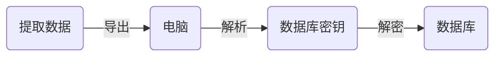
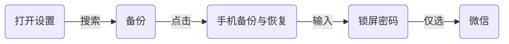

最近对微信解密有点小兴趣，于是在网上找了下相关教程，发现了这篇[文章](https://blog.greycode.top/posts/android-wechat-bak/)，对着实践了下发现效果不错，在这里记录下。

<!--more-->

## 处理流程

先来看看处理流程



## 提取数据

[原文](https://blog.greycode.top/posts/android-wechat-bak/)使用的是Root后的模拟器`adb pull` 来获取相关文件，但经过网上查询得知使用手机自带的备份恢复功能也可以达到相同效果，这里使用备份方式。

由于我用的小米，这里只记录小米的数据提取方式，其他型号可以做简单参考



备份结束之后，连接电脑进行文件传输，在手机 `MIUI/backup/AllBacup/` 最近备份的目录下，找到文件 `微信(com.tencent.mm).bak` 拷贝至电脑，该 `bak` 文件即包含微信应用所有文件

用解压工具解压 `bak` 文件，进入 `apps/com.tencent.mm` 目录，在 `r/MicroMsg` 目录中包含着聊天相关的消息数据，目录中一般有一个类似 MD5 的32位字母文件夹，目录结构如下

- `[32位字母]/EnMicroMsg.db` 聊天数据库
- `[32位字母]/WxFileIndex.db` 文件索引
- `[32位字母]/image2` 图片文件
- `[32位字母]/voice2` 语音文件
- `[32位字母]/voide` 视频文件
- `[32位字母]/avatar` 微信头像

## 解析密钥

db 结尾的微信数据库由 [sqlcipher](https://github.com/sqlcipher/sqlcipher) 加密存储，所以要查询里面的内容必须要找到相关的密钥方可处理，根据原文可知密钥计算规则为 `MD5(IMEI+uin)` 前七位小写字母，密钥获取的方式也可以借鉴参考[此文章](https://www.jianshu.com/p/7baa8940b477)

>IMEI 为手机的 IMEI 码，可以查询手机的设置，在设置中可以查看到。如果刷过机，那么 IMEI 有可能是空白的。或者像 MIUI 系统一样，应用无法真正获取到手机的 IMEI。这时就可以用 1234567890ABCDEF 这个字符串来代替 IMEI。

按原文描述，查了下确认小米手机 IMEI 是无法真实获取的，所以本例中的 IMEI 码为 `1234567890ABCDEF`

接着是获取 uin 值，这个值在 `apps/com.tencent.mm/sp/auth_info_key_prefs.xml` 中存储，类似如下内容

```xml
<?xml version='1.0' encoding='utf-8' standalone='yes' ?>
<map>
    <boolean name="auth_info_prefs_use_new_ecdh" value="true" />
    <int name="_auth_uin" value="xxxxxx" />
    <boolean name="key_auth_info_prefs_created" value="true" />
    <int name="key_auth_update_version" value="xxx" />
    <string name="server_id">xxx</string>
    <string name="_auth_key">xxxx</string>
</map>
```

其中 `_auth_uin` 的 `value` 即为 uin，按格式计算 MD5 值，如下为命令行

```bash
echo -n '1234567890ABCDEFxxxxxx' | md5sum | cut -c1-7
```

得到密钥值 `d3383be`

## 解密数据库

终于到了激动人心解密 db 的时刻了，这里涉及到编译安装 `sqlcipher`，查了下 `alpine` 软件库包含`sqlcipher`，所以直接构建一个带 `sqlcipher`的 `alpine` 镜像， Dockerfile 内容如下

```dockerfile
FROM alpine:3.19
RUN sed -i 's/dl-cdn.alpinelinux.org/mirrors.aliyun.com/g' /etc/apk/repositories  \
    && apk add --no-cache sqlcipher

```

```bash
# 构建镜像
docker build . -t sqlcipher:alpine
# 创建容器
docker run --name 'sqlcipher' -id sqlcipher:alpine
# 拷贝数据库入容器
docker cp EnMicroMsg.db sqlcipher:/tmp
docker cp WxFileIndex.db sqlcipher:/tmp
# 进入容器
docker exec -it sqlcipher sh
# 进入目录
cd /tmp
```

接下来便是执行解密，如下是解密 `EnMicroMsg.db` 示例

```bash
$ sqlcipher EnMicroMsg.db
SQLite version 3.42.0 2023-05-16 12:36:15 (SQLCipher 4.5.5 community)
Enter ".help" for usage hints.
sqlite> PRAGMA key = '密钥值';
ok
sqlite> PRAGMA cipher_use_hmac = off;
sqlite> PRAGMA kdf_iter = 4000;
sqlite> PRAGMA cipher_page_size = 1024;
sqlite> PRAGMA cipher_hmac_algorithm = HMAC_SHA1;
sqlite> PRAGMA cipher_kdf_algorithm = PBKDF2_HMAC_SHA1;
sqlite> ATTACH DATABASE 'plaintext.db' AS plaintext KEY '';
sqlite> SELECT sqlcipher_export('plaintext');
sqlite> DETACH DATABASE plaintext;
```

同理可以解密 `WxFileIndex.db` 文件

`EnMicroMsg.db` 数据库中有许多的表，但是比较有用的是如下几张表：

- userinfo 表：存储个人信息，其中 id 为 2 的 value 是个人的微信 id。
- message 表：存储所有的聊天记录。
- chatroom 表：存储所有群聊信息。
- img_flag 表：存储所有用户的在线头像的信息。如果本地 avatar 文件夹没有头像时，可以用这个表的地址来访问用户的头像，其中 reserved2 是缩略图，reserved1 是高清图。
- rcontact 表：存放所有的好友信息。

## 消息内容解析

这部分内容主要引用原文，在 `message` `表中，type` 字段表示着当前消息的类型，一般有如下类型：

- 1：文本消息
- 3：图片消息
- 34：语音消息
- 43：视频消息
- 47：大表情消息
- 49：分享卡片信息
- 1000：撤回消息提醒
- 436207665：微信红包
- 419430449：微信转账
- 1090519089：文件消息 上面的一些媒体类型的消息，例如图片、语音、视频等，都会可以用 msgId 字段去 WxFileIndex.db 数据库中的 WxFileIndex2 表中查找到对应的文件路径。 除了通过去 WxFileIndex2 表查询媒体文件的路径，还可以通过某些字段的拼接和加密直接获取媒体文件的路径。

### 图片地址获取

图片消息的地址有两个，一个是图片缩略图，一个是图片原图。

- 缩略图获取: 在 message 表中，如果当前消息为图片消息时，imgPath 字段会有值，值类似于：THUMBNAIL_DIRPATH://th_5a24c5d362dae72b0ad52d78767ba883，其中 5a24 代表 /5a/24 文件夹下的，th_5a24c5d362dae72b0ad52d78767ba883 是图片文件名。图片的父目录就是一开始的 /image2 文件夹。
- 原图获取: 如果要获取原图，则是通过另外一种拼接规则来得到图片地址的。一般有两种情况：
  - 发送的图片：文件名是：自己的wxid+_+当前的talker值+_+当前msgSvrid+_backup，路径是文件名的前两个字母，每两个字母代表一个文件夹层级。
  - 接收的图片：文件名是：当前的talker值+_+自己的wxid_+当前msgSvrid+_backup，路径是文件名的前两个字母，每两个字母代表一个文件夹层级。

### 视频地址获取

直接通过 `message` 表后的 `imgPath` 查找到 `video` 文件夹查找对应的视频，封面图后缀为 `.jpg`，视频后缀为：`.mp4`。

### 语音地址获取

`message` 的 `imgPath` 字段通过 MD5 加密后，前 4 个字母代表两级文件夹名，然后最终文件名是：`msg_imgPath`的值.amr

### 本地头像获取

微信的头像都存放在 [32位字母]/avatar 文件夹下，微信 ID 通过 MD5 加密后，前 4 个字母代表两级文件夹名，每两位代表一个文件夹名，文件名格式：user_md5字符串.png

## 写在最后

一开始解密当初衷是用SQL做一些聊天统计，发现确实能做之后就索然无味了，但是还是作下记录，希望可以帮到大家。