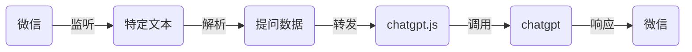

将 ChatGPT 接入微信并不是最近才做，而是2023年上半年就已经做了，那时候采用官方注册赠送的API，但这个API是有时效的，过期之后服务就中断了。本来也没想折腾的，但是年底报告终结什么的也比较多，想想还是再研究研究，于是便有了这篇博客。
<!--more-->

## 初步分析

真正体验用过 ChatGPT 的人都ba知道 ChatGPT 是有网页版的，而且网页版3.5是可以白嫖的，于是我便瞄准了这个入口。经过初步分析有两条路可走：

- 模拟 Web 端的界面操作，实现输入输出
- 逆向 Web 端的API接口，模拟接口调用

一开始是准备逆向 API 接口的，接口很容易找到，但 `curl` 模拟请求时总是 403，猜测接口是使用了某些防护机制，后面收集信息证实 Openai 用了 Cloudflare 的反爬虫机制，具体可以参考这个篇[文章](https://linweiyuan.github.io/2023/03/14/%E4%B8%80%E7%A7%8D%E5%8F%96%E5%B7%A7%E7%9A%84%E6%96%B9%E5%BC%8F%E7%BB%95%E8%BF%87-Cloudflare-v2-%E9%AA%8C%E8%AF%81.html)。

接口调用遇阻，于是便考虑先使用界面模拟，找了下发现了[chatgpt.js](https://github.com/kudoai/chatgpt.js)这个库，该库通过注入 js 实现对 chatgpt 操作。关于注入工具用的是大名顶顶的[篡改猴](https://www.tampermonkey.net/)，chatgpt.js 官方甚至贴心的提供了一套[模板](https://github.com/KudoAI/chatgpt.js-greasemonkey-starter/blob/main/chatgpt.js-greasemonkey-starter.user.js)帮助我们写出想要的功能。

## 整体流程

确定方向后就要开始构建整体流程了，按照分析 大概有如下两个端

- 浏览器端，负责接收指令消息调用 `chatgpt.js` 函数
- 微信监听端，负责监听特定的消息，转发给浏览器端，并将结果返回给微信端，关于消息监听已经有现成的库 [openwechat](https://github.com/eatmoreapple/openwechat)，可以直接上手使用。

大致流程如下



## 服务端

服务端主要有两个功能

- 作为 websocket 服务与浏览器端的 `chatgpt.js` 连接通信
- `openwechat` 监听特定的微信消息，转发给已连接的 `chatgpt.js` 调用，并将结果返回

由于涉及 websocket 在浏览器与 `openwechat` 通讯，这里先定义通信消息体

```go
import (
	"strings"

	"github.com/eatmoreapple/openwechat"
)

func newMsg(msg *openwechat.Message) *chatMsg {
	req := strings.SplitN(msg.Content, " ", 2)
	return &chatMsg{
		msg:     msg,
		ID:      msg.MsgId,
		Content: req[1],
		done:    make(chan struct{}, 1),
	}
}

type chatMsg struct {
	msg     *openwechat.Message // 原始消息
	done    chan struct{}       // 异步通知
	ID      string `json:"id,omitempty"`      // 消息ID
	Content string `json:"content,omitempty"` // 消息内容
}

func (m *chatMsg) replay(text string) {
	m.done <- struct{}{}  // 通知外部go程 处理结束
	m.msg.ReplyText(text) // 回复消息
}
```

有了消息体，那么就要开始构建一个 websocket 服务用于沟通 `chatgpt.js` 与 微信

```go
import (
	"encoding/json"
	"fmt"
	"log"
	"net"
	"net/http"
	"strings"
	"sync"
	"time"

	"github.com/eatmoreapple/openwechat"
	"github.com/gobwas/ws"
	"github.com/gobwas/ws/wsutil"
)

type bot struct {
	web  net.Conn
	msg  sync.Map
	msgs chan *openwechat.Message
}
// 初始化函数
func (b *bot) init() {
	// 创建消息通道
	b.msgs = make(chan *openwechat.Message, 128)
	go b.process()

	bot := openwechat.DefaultBot(openwechat.Desktop) // 桌面模式
	// 注册消息处理函数
	bot.MessageHandler = b.messageHandler
	// 注册登陆二维码回调
	bot.UUIDCallback = openwechat.PrintlnQrcodeUrl

	// 登陆
	if err := bot.Login(); err != nil {
		fmt.Println(err)
		return
	}
}
// 消息处理函数
func (b *bot) messageHandler(msg *openwechat.Message) {
	if !msg.IsText() {
		return
	}
	if b.web == nil {
		log.Println("web not connect")
		return
	}
	val := msg.Content
	// 处理以 `bot ` 开头的消息
	if !strings.HasPrefix(val, "bot ") {
		return
	}
	// 入队处理
	b.msgs <- msg
}
// 消息处理
func (b *bot) process() {
	for msg := range b.msgs {
		m := newMsg(msg)
		b.msg.Store(m.ID, m)
		data, _ := json.Marshal(m)
		// 通知 `chatgpt.js` 处理
		err := wsutil.WriteServerText(b.web, data)
		if err != nil {
			log.Println(err)
			continue
		}
		select {
		// 等待 `chatgpt.js` 响应
		case <-m.done:
		// 超时处理下一条
		case <-time.After(2 * time.Minute):
			log.Println("reply time out")
		}
	}
}
// 用于 chatgpt.js 接入
func (b *bot) http(w http.ResponseWriter, r *http.Request) {
	ws, _, _, err := ws.UpgradeHTTP(r, w)
	if err != nil {
		w.WriteHeader(500)
		return
	}
	b.web = ws
	for {
		data, err := wsutil.ReadClientText(ws)
		if err != nil {
			log.Println("read client data error", err)
			break
		}
		var resp chatMsg
		json.Unmarshal(data, &resp)
		// 加载并回复微信消息
		if val, ok := b.msg.LoadAndDelete(resp.ID); ok {
			(val.(*chatMsg)).replay(resp.Content)
		}
	}
}
```

以上便完成了服务端的工作，写一个简单的单元测试运行起来

```go
func TestWs(t *testing.T) {
	mux := http.NewServeMux()
	b := &bot{}
	go b.init()
	mux.HandleFunc("/chatgpt", b.http)
	http.ListenAndServe(":8000", mux)
}
```

扫码登录后，便开始浏览器端的 `chatgpt.js` 工作。

## 浏览器端

要开始这部分，需要先安装两个扩展程序

- [篡改猴](https://chrome.google.com/webstore/detail/dhdgffkkebhmkfjojejmpbldmpobfkfo)用于植入 chatgpt.js 相关脚本
- [Disable Content-Security-Policy](https://chrome.google.com/webstore/detail/ieelmcmcagommplceebfedjlakkhpden) 用于关闭内容检查

安装之后单击篡改猴扩展程序图标，选择添加新脚本，基于[官方模板](https://github.com/KudoAI/chatgpt.js-greasemonkey-starter/blob/main/chatgpt.js-greasemonkey-starter.user.js)添加如下内容

```js
// ==UserScript==
// @name          ChatGPT Userscript
// @description   A Greasemonkey template to start using chatgpt.js like a boss
// @author        chatgpt.js
// @namespace     https://chatgpt.js.org
// @version       2023.12.23
// @license       MIT
// @match         https://chat.openai.com/*
// @require       https://cdn.jsdelivr.net/gh/kudoai/chatgpt.js@3ff1d910a62b989e02da86c8c4dd3ce14232216e/dist/chatgpt-2.6.3.min.js
// @grant         GM_getValue
// @grant         GM_setValue
// @noframes
// ==/UserScript==
function connect(chatgpt) {
    // 连接 websocket 服务
    const socket = new WebSocket("ws://127.0.0.1:8000/chatgpt");
    socket.addEventListener("message", async (event) => {
		// 读取 websocket 消息
        const msg = JSON.parse(event.data);
        console.log("Message from server ", event.data);
		// 调用函数提问并获取响应
        const response = await chatgpt.askAndGetReply(msg.content);
        msg.content = response;
		// 返回给 websocket 服务端
        config.socket.send(JSON.stringify(msg))
    });
}

(async () => {
    const config = { socket: null };
    await chatgpt.isLoaded();
    chatgpt.autoRefresh.activate();
    connect(chatgpt);
})();
```

刷新 ChatGPT 网站，点击 `Disable Content-Security-Policy` 扩展程序使其处于可用状态。尝试在微信群里发 `bot ` 开头的内容即可触发沟聊天流程。

## 写在最后

以上只是一个可以运行的简陋版本，实际使用还要加上鉴权重连之类的能力，不过即使完善优化后实际使用效果仍然差强人意，毕竟没有摆脱浏览器的束缚，电脑也要一直开着，着实不够优雅，但也算是实现了相关需求，希望可以帮到大家。