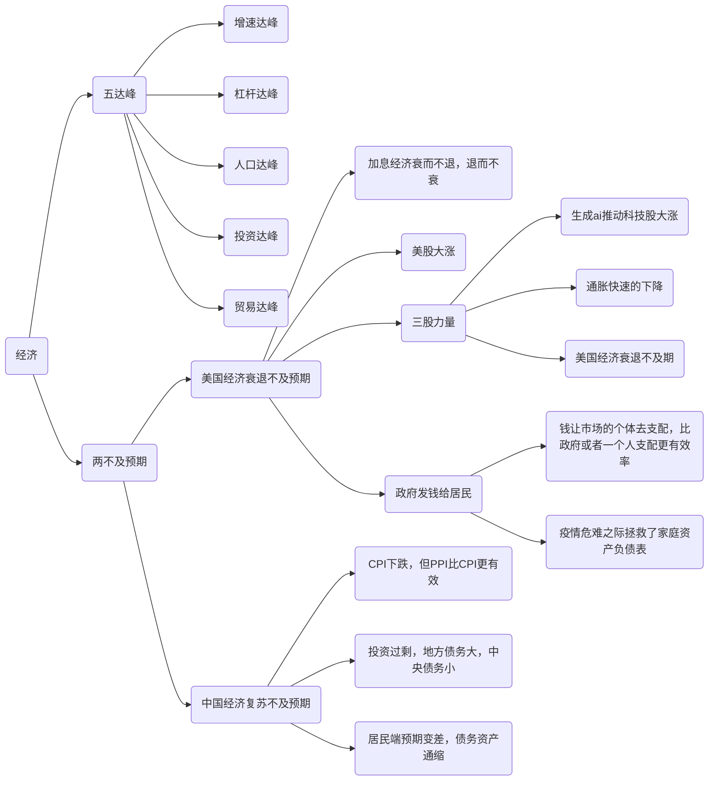
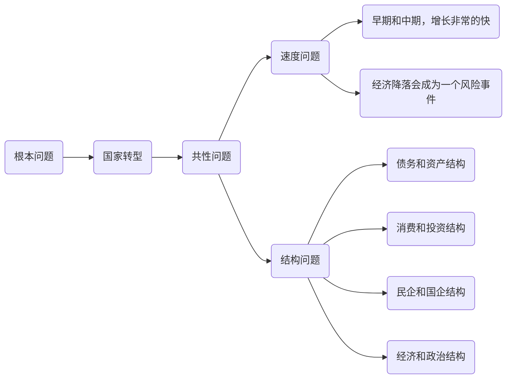
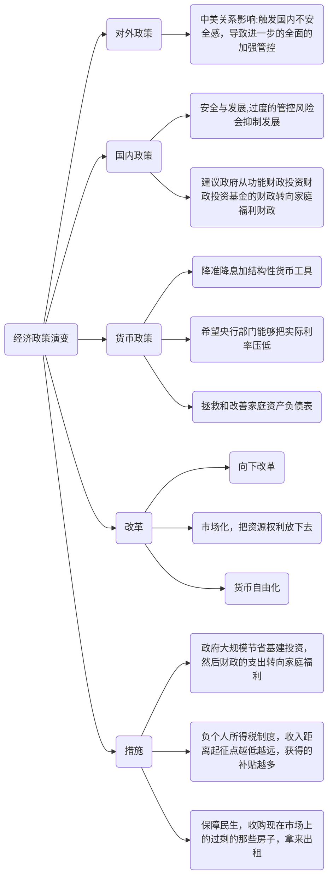
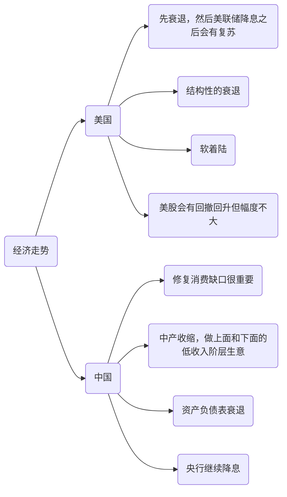
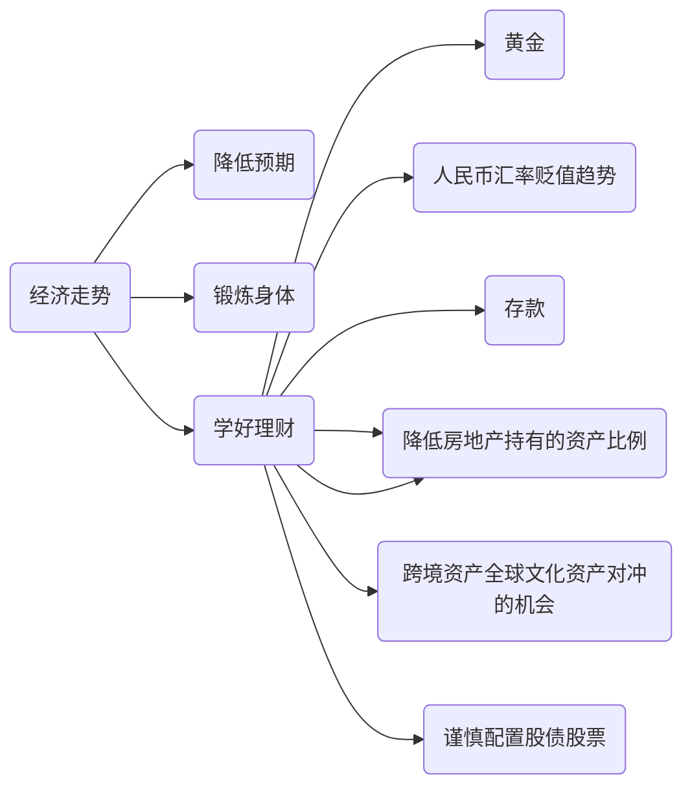

最近买了一份课程，是关于宏观经济分析的演讲，个人觉得讲的还是很不错，于是用了些技术手段抓下来分享给大家看看。我特别喜欢一句话：你不关心zz，zz就会来关心你。在我看来经济也是如此，通过经济的粗浅学习或许可以对生活决策做一些指导。

<!--more-->

## 当前经济形势

第一部分节介绍了当前的经济形势，大致介绍了如下内容

<video controls>
  <source src="https://x.wuzk.ink/share/blog/2024/20240226/01.mp4" type="video/mp4" />
</video>

## 经济根本问题

<video controls>
  <source src="https://x.wuzk.ink/share/blog/2024/20240226/02.mp4" type="video/mp4" />
</video>

## 经济政策演变

<video controls>
  <source src="https://x.wuzk.ink/share/blog/2024/20240226/03.mp4" type="video/mp4" />
</video>

## 未来经济走势

<video controls>
  <source src="https://x.wuzk.ink/share/blog/2024/20240226/04.mp4" type="video/mp4" />
</video>

## 家庭资产配置

<video controls>
  <source src="https://x.wuzk.ink/share/blog/2024/20240226/05.mp4" type="video/mp4" />
</video>

## 写在最后

不知道大家在看完之后有没有一些收获，又有什么感想，我的话是感慨于演讲者对经济的洞若观火，再就是对未来经济有了一个大致的画像，悲观者常正确，做好悲观的打算才能走的更远，从而不会在黎明前倒下。